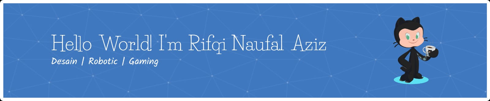

<!--
**MasAz1/MasAz1** is a ✨ _special_ ✨ repository because its `README.md` (this file) appears on your GitHub profile.

Here are some ideas to get you started:

- 🔭 I’m currently working on ...
- 🌱 I’m currently learning ...
- 👯 I’m looking to collaborate on ...
- 🤔 I’m looking for help with ...
- 💬 Ask me about ...
- 📫 How to reach me: ...
- 😄 Pronouns: ...
- ⚡ Fun fact: ...
-->

  

###
-  I’m currently learning [**Laravel**](http://laravel.com) Framwork

#### Skills

#### Conect With Me

<h3 align="left">Play Game</h3>

###

###

 

###
